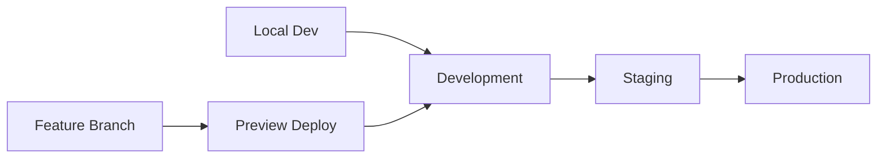

# Repository Structure & Monorepo Migration Plan

## Overview
This document outlines the monorepo structure for the KGC Healthcare Platform and the migration plan from the current single-repository structure to a well-organized workspace-based monorepo.

## Current Structure (Pre-Migration)
```
kgc-healthcare/
├── client/                    # React frontend application
├── server/                    # Express.js backend application  
├── shared/                    # Shared types and database schemas
├── public/                    # Static assets and PWA manifest
├── docs/                      # Documentation
├── config/                    # Configuration files
├── scripts/                   # Build and deployment scripts
├── package.json               # Single package configuration
├── tsconfig.json              # Single TypeScript configuration
└── vite.config.ts             # Vite build configuration
```

## Target Monorepo Structure (Post-Migration)
```
kgc-healthcare-monorepo/
├── apps/                      # Frontend applications
│   └── web/                   # Main web application (React + Vite)
│       ├── src/               # React application source
│       ├── public/            # Static assets
│       ├── package.json       # Web app dependencies
│       ├── vite.config.ts     # Vite configuration
│       ├── tsconfig.json      # Extends base config
│       └── README.md          # Web app documentation
│
├── services/                  # Backend services
│   ├── api/                   # Main API service (Express.js)
│   │   ├── src/               # API source code
│   │   ├── package.json       # API dependencies
│   │   ├── tsconfig.json      # Extends base config
│   │   ├── Dockerfile         # Container configuration
│   │   └── README.md          # API documentation
│   │
│   └── privacy-proxy/         # Privacy protection service
│       ├── src/               # Privacy service source
│       ├── package.json       # Privacy service dependencies
│       ├── tsconfig.json      # Extends base config
│       ├── Dockerfile         # Container configuration
│       └── README.md          # Privacy service documentation
│
├── packages/                  # Shared libraries
│   └── shared/                # Shared types, utils, schemas
│       ├── src/               # Shared source code
│       │   ├── types/         # TypeScript type definitions
│       │   ├── schemas/       # Database and validation schemas
│       │   ├── utils/         # Utility functions
│       │   ├── config/        # Configuration constants
│       │   └── index.ts       # Main exports
│       ├── package.json       # Shared package dependencies
│       ├── tsconfig.json      # Extends base config
│       └── README.md          # Shared package documentation
│
├── docs/                      # Documentation (preserved)
├── config/                    # Global configuration (preserved)
├── scripts/                   # Monorepo scripts and tools
├── .github/                   # GitHub Actions workflows
├── package.json               # Root package with workspaces
├── pnpm-workspace.yaml        # PNPM workspace configuration
├── tsconfig.base.json         # Base TypeScript configuration
├── .eslintrc.cjs              # ESLint configuration
├── .prettierrc                # Prettier configuration
├── .editorconfig              # Editor configuration
├── .gitattributes             # Git attributes
└── .gitignore                 # Git ignore rules (updated)
```

## Workspace Configuration

### Root Package.json (Future)
```json
{
  "name": "kgc-healthcare-monorepo",
  "version": "1.0.0",
  "private": true,
  "type": "module",
  "workspaces": [
    "apps/*",
    "services/*", 
    "packages/*"
  ],
  "scripts": {
    "dev": "pnpm --parallel --stream run dev",
    "build": "pnpm --stream run build",
    "test": "pnpm --stream run test",
    "type-check": "pnpm --stream run type-check",
    "lint": "pnpm --stream run lint",
    "format": "prettier --write \"**/*.{ts,tsx,js,jsx,json,md}\"",
    "clean": "pnpm --parallel run clean",
    "db:push": "pnpm --filter @kgc/api run db:push",
    "db:studio": "pnpm --filter @kgc/api run db:studio"
  },
  "devDependencies": {
    "@typescript-eslint/eslint-plugin": "^6.0.0",
    "@typescript-eslint/parser": "^6.0.0",
    "eslint": "^8.0.0",
    "prettier": "^3.0.0",
    "typescript": "^5.0.0"
  }
}
```

### PNPM Workspace Configuration
```yaml
packages:
  # Applications (Vercel/Netlify deployments)
  - "apps/*"
  
  # Backend Services (AWS/GCP/Docker deployments)
  - "services/*"
  
  # Shared Libraries (packages used across apps/services)
  - "packages/*"
```

## Migration Phases

### Phase P7: Scaffold Creation (CURRENT)
✅ **Status**: Complete
- [x] Create monorepo directory structure
- [x] Set up workspace configuration files
- [x] Configure TypeScript base configuration
- [x] Set up code formatting and linting
- [x] Create placeholder README files
- [x] Update .gitignore for monorepo patterns

### Phase P8: Shared Package Migration
**Target**: Extract shared code into dedicated package
- [ ] Move `shared/` → `packages/shared/src/`
- [ ] Create `packages/shared/package.json`
- [ ] Update import paths to use `@kgc/shared`
- [ ] Configure package build and publish
- [ ] Update TypeScript path mapping

### Phase P9: Privacy Service Extraction
**Target**: Create dedicated privacy proxy service
- [ ] Extract privacy logic from main API
- [ ] Create `services/privacy-proxy/`
- [ ] Implement service-to-service communication
- [ ] Set up Docker containerization
- [ ] Configure independent deployment

### Phase P10: API Service Migration
**Target**: Move backend to dedicated service
- [ ] Move `server/` → `services/api/src/`
- [ ] Create `services/api/package.json`
- [ ] Update dependencies and build scripts
- [ ] Configure Docker for containerization
- [ ] Update deployment configurations

### Phase P11: Web App Migration
**Target**: Move frontend to dedicated app
- [ ] Move `client/` → `apps/web/src/`
- [ ] Move `public/` → `apps/web/public/`
- [ ] Create `apps/web/package.json`
- [ ] Update Vite configuration
- [ ] Configure Vercel deployment

### Phase P12: CI/CD Updates
**Target**: Update deployment pipelines
- [ ] Update GitHub Actions workflows
- [ ] Configure workspace-based deployments
- [ ] Set up independent service deployments
- [ ] Update environment variable management
- [ ] Configure cross-service testing

## Workspace Benefits

### Development Experience
- **Unified Dependencies**: Shared dev tools across all packages
- **Type Safety**: Consistent TypeScript configuration
- **Code Sharing**: Easy import of shared utilities and types
- **Parallel Development**: Run multiple services simultaneously
- **Consistent Tooling**: Unified linting, formatting, and testing

### Deployment Flexibility
- **Independent Deployments**: Each service can be deployed separately
- **Scalability**: Services can scale independently
- **Technology Diversity**: Different services can use different tech stacks
- **Fault Isolation**: Issues in one service don't affect others
- **Resource Optimization**: Allocate resources based on service needs

### Maintenance & Development
- **Clear Boundaries**: Well-defined service responsibilities
- **Shared Code**: Avoid duplication across services
- **Version Management**: Independent versioning for each package
- **Testing**: Isolated testing for each component
- **Documentation**: Service-specific documentation

## Current Code Mapping

### Frontend Code Migration
```
Current Structure              →    Target Structure
client/src/                   →    apps/web/src/
client/src/components/        →    apps/web/src/components/
client/src/pages/             →    apps/web/src/pages/
client/src/lib/               →    apps/web/src/lib/
public/                       →    apps/web/public/
vite.config.ts               →    apps/web/vite.config.ts
```

### Backend Code Migration
```
Current Structure              →    Target Structure
server/                       →    services/api/src/
server/routes/                →    services/api/src/routes/
server/services/              →    services/api/src/services/
server/middleware/            →    services/api/src/middleware/
server/config/                →    services/api/src/config/
server/ai/                    →    services/api/src/ai/
```

### Shared Code Migration
```
Current Structure              →    Target Structure
shared/                       →    packages/shared/src/
shared/schema.ts              →    packages/shared/src/schemas/database.ts
shared/types.ts               →    packages/shared/src/types/index.ts
```

### Privacy Service Extraction
```
Current Structure                        →    Target Structure
server/services/privacyProtectionAgent.ts → services/privacy-proxy/src/agents/
server/services/privacyService.ts        → services/privacy-proxy/src/services/
server/encryptionService.ts              → services/privacy-proxy/src/crypto/
```

## Package Naming Convention

### Scoped Package Names
- `@kgc/web` - Web application
- `@kgc/api` - API service  
- `@kgc/privacy-proxy` - Privacy proxy service
- `@kgc/shared` - Shared utilities and types
- `@kgc/config` - Configuration management (future)
- `@kgc/cli` - Command line tools (future)

### Import Examples
```typescript
// Before (relative paths)
import { User } from '../../../shared/schema';
import { sanitizeInput } from '../../server/utils';

// After (scoped packages)
import { User } from '@kgc/shared/types';
import { sanitizeInput } from '@kgc/shared/utils';
```

## Development Workflow

### Starting Development
```bash
# Install all dependencies
pnpm install

# Start all services in development mode
pnpm dev

# Start specific service
pnpm --filter @kgc/web dev
pnpm --filter @kgc/api dev
```

### Building for Production
```bash
# Build all packages
pnpm build

# Build specific package
pnpm --filter @kgc/web build
pnpm --filter @kgc/api build
```

### Testing
```bash
# Run all tests
pnpm test

# Test specific package
pnpm --filter @kgc/api test

# Run integration tests
pnpm test:integration
```

## Deployment Strategy

### Independent Deployments
- **Web App**: Vercel/Netlify (static deployment)
- **API Service**: AWS App Runner/Google Cloud Run (containerized)
- **Privacy Proxy**: AWS ECS/Google Cloud Run (containerized)
- **Shared Package**: NPM registry (internal)

### Environment Promotion


### Rollback Strategy
- Independent service rollbacks
- Database migration rollbacks
- Shared package version pinning
- Environment-specific configurations

## Migration Checklist

### Pre-Migration (Current Phase)
- [x] ✅ Create monorepo structure
- [x] ✅ Set up workspace configuration
- [x] ✅ Configure development tooling
- [x] ✅ Plan migration phases

### During Migration (P8-P12)
- [ ] 🔄 Migrate shared package
- [ ] 🔄 Extract privacy service  
- [ ] 🔄 Migrate API service
- [ ] 🔄 Migrate web application
- [ ] 🔄 Update CI/CD pipelines

### Post-Migration Validation
- [ ] 🔄 Verify all services build correctly
- [ ] 🔄 Test service-to-service communication
- [ ] 🔄 Validate deployment pipelines
- [ ] 🔄 Run end-to-end tests
- [ ] 🔄 Performance testing
- [ ] 🔄 Update documentation

## Rollback Plan

### Emergency Rollback
If migration issues occur:
1. **Preserve Current Code**: All current code remains in place
2. **Revert Configurations**: Roll back workspace configurations
3. **Restore Original Structure**: Use current package.json and tsconfig.json
4. **Deploy from Current**: Continue deployments from existing structure

### Gradual Migration
- Migrate one service at a time
- Validate each migration step
- Maintain backward compatibility
- Keep dual deployment capability during transition

## Success Metrics

### Development Metrics
- Reduced build times through caching
- Improved type safety across services
- Faster development server startup
- Simplified dependency management

### Operational Metrics
- Independent service deployments
- Reduced deployment complexity  
- Improved fault isolation
- Better resource utilization

### Team Metrics
- Clearer code ownership
- Reduced merge conflicts
- Improved code discoverability
- Enhanced collaboration workflows