# Keep Going Care (KGC) - Macro Architecture Overview

**System Type:** Healthcare SaaS Platform (Class I Software as Medical Device)  
**Compliance:** TGA (Australia), HIPAA-ready  
**Architecture:** Microservices with AI Integration  
**Target Scale:** 1 Admin → 10 Doctors → Millions of Patients

## Important: Non-Diagnostic Scope

**KGC is non-diagnostic software.** The platform provides:
- Educational health content and guidance
- Care plan directive management and tracking
- Motivational support and engagement tools
- Progress monitoring and milestone tracking
- AI-powered health assistant for general wellness guidance

**KGC does NOT:**
- Provide medical diagnoses
- Replace professional medical advice
- Make treatment recommendations
- Interpret medical test results
- Provide emergency medical services

All health-related guidance is educational and supportive in nature, designed to complement professional healthcare under doctor supervision.

## System Context Diagram

## Container Diagram

## Sequence Diagrams

### 1. Passwordless Sign-in via SendGrid

### 2. Patient Daily Self-Scores Update

### 3. Doctor Sets Care Plan Directives → Agent Guidance

### 4. KGC Chat Turn with Privacy-Redaction Proxy

```mermaid
sequenceDiagram
    participant P as Patient
    participant F as Frontend
    participant API as Backend API
    participant SA as Supervisor Agent  
    participant PPA as Privacy Protection Agent
    participant MCP as MCP Service
    participant AI as OpenAI/Anthropic
    participant DB as PostgreSQL

    P->>F: "I'm struggling with my diabetes medication timing"
    F->>API: POST /api/chat
    API->>SA: Process patient message
    SA->>DB: Load patient context (CPDs, health metrics)
    DB-->>SA: Patient profile + recent scores
    
    SA->>PPA: Anonymize message for AI
    PPA->>PPA: Detect PII: "diabetes" → "CONDITION_A"
    PPA-->>SA: {anonymized: "I'm struggling with my CONDITION_A medication timing", sessionId: "uuid123"}
    
    SA->>MCP: Select appropriate healthcare tool
    MCP->>AI: Call with anonymized context
    AI-->>MCP: "For CONDITION_A medication timing, consider..."
    MCP-->>SA: AI response received
    
    SA->>PPA: De-anonymize response
    PPA->>PPA: Replace placeholders: "CONDITION_A" → "diabetes"
    PPA-->>SA: "For diabetes medication timing, consider..."
    
    SA->>DB: Log interaction for compliance
    DB-->>SA: Audit trail recorded
    SA-->>API: {message: "Helpful response", emergencyDetected: false}
    API-->>F: Chat response
    F-->>P: Display AI guidance with CPD alignment
```

### 5. Generating Progress Snapshots & Sentiment Rollups

## Data Flow Architecture

### Core Data Entities
- **Users** (hierarchical: admin → doctor → patient)
- **Care Plan Directives** (doctor-defined health goals)
- **Health Metrics** (real-time patient scores)
- **Patient Scores** (official daily submissions)
- **Progress Milestones** (achievement tracking)
- **Chat Memory** (AI context and learning)

### Real-time Data Flows
1. **Health Score Submission** → Immediate CPD compliance calculation
2. **CPD Updates** → Real-time patient dashboard sync
3. **Chat Interactions** → Context-aware AI responses
4. **Achievement Triggers** → Badge system activation
5. **Emergency Detection** → Immediate alert escalation

## Deployment Architecture

### Target Deployment Environments

#### Primary: AWS Asia Pacific (Sydney) - ap-southeast-2
- **Compute:** AWS App Runner (containerized deployment)
- **Database:** Neon PostgreSQL (serverless, auto-scaling)
- **Secrets:** AWS Secrets Manager
- **CDN:** CloudFront for static assets
- **Monitoring:** CloudWatch for healthcare compliance logging

#### Alternative: Google Cloud Platform
- **Compute:** Google Cloud Run (serverless containers)
- **Database:** Cloud SQL PostgreSQL or Neon
- **Secrets:** Google Secret Manager
- **CDN:** Cloud CDN

#### Development: Replit
- **Environment:** Unified development platform
- **Database:** In-memory fallback for rapid development
- **Hot Reload:** Vite + tsx for instant feedback

### Security & Compliance Considerations
- **TLS/HTTPS:** All communications encrypted
- **PII Protection:** Privacy proxy before external AI calls
- **Audit Logging:** All healthcare interactions logged
- **Session Security:** HTTP-only cookies + JWT tokens
- **Rate Limiting:** Protection against abuse
- **Emergency Detection:** Real-time safety monitoring

### Scalability Patterns
- **Stateless Backend:** Horizontal scaling ready
- **Database Connection Pooling:** Efficient resource usage
- **CDN Integration:** Global asset delivery
- **Microservice Architecture:** Independent service scaling
- **AI Provider Failover:** Multi-provider reliability

## Technology Stack Summary

### Frontend
- **React 18** with TypeScript for type safety
- **Vite** for fast development and optimized builds
- **Tailwind CSS + shadcn/ui** for consistent design
- **TanStack Query** for efficient data fetching
- **PWA** capabilities for offline access

### Backend  
- **Express.js** with TypeScript for API services
- **Drizzle ORM** for type-safe database operations
- **PostgreSQL** for healthcare data persistence
- **WebSocket** for real-time patient updates

### AI Integration
- **Model Context Protocol (MCP)** for healthcare tools
- **OpenAI GPT-4o** for primary AI responses
- **Anthropic Claude 3.7** for secondary AI provider  
- **Privacy Protection Agent** for PII anonymization

### External Services
- **SendGrid** for email authentication and notifications
- **Twilio** for SMS verification and alerts
- **Tavily** for validated health content search
- **AWS/GCP** for production infrastructure

### Healthcare Compliance
- **TGA Class I SaMD** architecture
- **HIPAA-ready** data protection
- **Audit logging** for regulatory compliance
- **Emergency detection** for patient safety

## TODO: Architecture Verification Needed

- **Load balancing configuration** for high availability
- **Database backup and disaster recovery** procedures  
- **Performance monitoring** integration beyond basic logging
- **Multi-region deployment** strategy for global access
- **Container orchestration** beyond single instance deployment
- **API versioning** strategy for healthcare integrations
- **Clinical workflow integration** with existing hospital systems
- **Medication interaction checking** capabilities validation
- **Healthcare outcome tracking** methodology confirmation