# KGC Domain Model and Entity Relationships

## Overview
This document defines the canonical domain model for Keep Going Care (KGC), a healthcare platform with hierarchical user management, AI-powered patient support, and comprehensive audit capabilities. The model reflects the actual database schema and business rules implemented in the codebase.

## Core Domain Entities

### User Hierarchy
- **Admin** - System administrator (1 per system)
- **Doctor** - Healthcare provider (up to 10 per admin)  
- **Patient** - Care recipient (unlimited per doctor)
- **PatientDoctorLink** - Assignment relationship between doctors and patients

### Healthcare Data
- **CarePlanDirective (CPD)** - Doctor-defined health goals and targets
- **DailySelfScore** - Patient-submitted daily health scores (diet, exercise, medication)
- **HealthSnapshot** - Aggregated health metrics and milestone tracking
- **MotivationEvent** - Patient engagement activities and media interactions

### AI and Communication
- **ChatMessage** - AI Supervisor Agent conversations with context
- **SentimentSnapshot** - Aggregated emotional and behavioral analysis
- **PrivacyRedactionEvent** - PII anonymization tracking for AI safety

### Compliance and Security
- **AuditLog** - Regulatory compliance tracking (TGA, HIPAA)
- **UserAuthIdentity** - Authentication events and security monitoring

## Entity Relationship Diagram

```mermaid
erDiagram
    %% User Hierarchy
    Admin ||--o{ Doctor : "creates/manages"
    Doctor ||--o{ Patient : "assigns/treats"
    UserRole ||--o{ Admin : "defines_permissions"
    UserRole ||--o{ Doctor : "defines_permissions"
    UserRole ||--o{ Patient : "defines_permissions"
    
    %% Healthcare Core Data
    Doctor ||--o{ CarePlanDirective : "defines"
    Patient ||--o{ CarePlanDirective : "receives"
    Patient ||--o{ DailySelfScore : "submits"
    Patient ||--o{ HealthSnapshot : "generates"
    Patient ||--o{ MotivationEvent : "creates"
    
    %% AI and Chat System
    Patient ||--o{ ChatMessage : "sends"
    ChatMessage }o--|| SupervisorAgent : "processes"
    ChatMessage ||--o{ PrivacyRedactionEvent : "triggers"
    Patient ||--o{ SentimentSnapshot : "analyzed_for"
    
    %% Progress and Achievements
    Patient ||--o{ ProgressMilestone : "earns"
    Patient ||--o{ PatientBadge : "awarded"
    DailySelfScore ||--o{ ProgressMilestone : "contributes_to"
    
    %% Reports and Analysis
    Doctor ||--o{ PatientProgressReport : "generates"
    Patient ||--o{ PatientProgressReport : "subject_of"
    HealthSnapshot ||--o{ PatientProgressReport : "feeds_into"
    
    %% Security and Compliance
    Admin ||--o{ AuditLog : "monitored_by"
    Doctor ||--o{ AuditLog : "monitored_by"
    Patient ||--o{ AuditLog : "monitored_by"
    Patient ||--o{ UserAuthIdentity : "authenticates_as"
    Doctor ||--o{ UserAuthIdentity : "authenticates_as"
    Admin ||--o{ UserAuthIdentity : "authenticates_as"
    
    %% Emergency System
    Patient ||--o{ EmergencyAlert : "triggers"
    Doctor ||--o{ EmergencyAlert : "receives"
    
    %% Content and Engagement
    Patient ||--o{ UserFavorite : "saves"
    Patient ||--o{ ContentInteraction : "performs"
    Patient ||--o{ FeatureUsage : "tracked_for"

    %% Entity Definitions
    Admin {
        integer id PK
        string uin UK "KGC-ADM-001 format"
        string name
        string email UK
        integer roleId FK
        string phoneNumber
        timestamp joinedDate
        boolean isActive
        timestamp lastLogin
        integer createdByUserId FK
    }
    
    Doctor {
        integer id PK
        string uin UK "KGC-DOC-001 format"
        string name
        string email UK
        integer roleId FK
        string phoneNumber
        timestamp joinedDate
        boolean isActive
        timestamp lastLogin
        integer createdByUserId FK
    }
    
    Patient {
        integer id PK
        string uin UK "KGC-PAT-001 format"
        string name
        string email UK
        integer roleId FK
        string phoneNumber
        timestamp joinedDate
        boolean isActive
        timestamp lastLogin
        integer assignedDoctorId FK
        integer createdByUserId FK
    }
    
    PatientDoctorLink {
        integer id PK
        integer doctorId FK
        integer patientId FK
        timestamp assignedDate
        boolean active
        string notes
        timestamp lastReviewed
    }
    
    CarePlanDirective {
        integer id PK
        integer userId FK
        string directive
        string category "diet|exercise|medication"
        real targetValue
        boolean active
        timestamp createdAt
        timestamp updatedAt
    }
    
    DailySelfScore {
        integer id PK
        integer patientId FK
        date scoreDate UK
        integer exerciseSelfScore "1-10"
        integer mealPlanSelfScore "1-10"
        integer medicationSelfScore "1-10"
        string notes
        timestamp createdAt
    }
    
    HealthSnapshot {
        integer id PK
        integer userId FK
        timestamp date
        real medicationScore "averaged"
        real dietScore "averaged"
        real exerciseScore "averaged"
        json progressMilestones
        real complianceRate
    }
    
    MotivationEvent {
        integer id PK
        integer userId FK
        string eventType "keep_going_button|feature_usage"
        json eventData
        string mediaUrl
        timestamp eventDate
        boolean processedByAgent
    }
    
    ChatMessage {
        integer id PK
        integer userId FK
        string memorySystem "semantic|procedural|episodic"
        string type "short_term|medium_term|long_term"
        string content
        json context
        real importance "0-1"
        string embeddings
        timestamp lastAccessed
        integer accessCount
        timestamp expiresAt
        timestamp createdAt
    }
    
    SentimentSnapshot {
        integer id PK
        integer patientId FK
        timestamp reportPeriodStart
        timestamp reportPeriodEnd
        real chatSentimentScore "-1 to 1"
        string chatSentimentAnalysis
        json behaviorInsights
        real engagementScore "0-100"
        json healthTrends
    }
    
    PrivacyRedactionEvent {
        integer id PK
        string sessionId UK
        string originalText
        string anonymizedText
        json piiMappings
        string policyVersion
        timestamp processedAt
        boolean deAnonymized
    }
    
    AuditLog {
        integer id PK
        string eventId UK
        timestamp timestamp
        string eventType "LOGIN|LOGOUT|DATA_ACCESS"
        string severity "LOW|MEDIUM|HIGH|CRITICAL"
        integer userId FK
        integer targetUserId FK
        string ipAddress
        string userAgent
        string details
        string complianceStandards
        string environment
    }
    
    UserAuthIdentity {
        integer id PK
        integer userId FK
        string authMethod "email_pin|sms_verification"
        string emailOrPhone
        string pinCode
        timestamp pinExpiry
        integer attemptCount
        boolean isVerified
        timestamp verifiedAt
        timestamp createdAt
    }
    
    UserRole {
        integer id PK
        string name UK "admin|doctor|patient"
        string description
        timestamp createdAt
    }
    
    ProgressMilestone {
        integer id PK
        integer userId FK
        string title
        string description
        string category "Diet|Exercise|Medication|Wellness|Engagement"
        real progress "0-100"
        boolean completed
        timestamp targetDate
        timestamp completedDate
        string iconType "Trophy|Medal|Star|Award|Calendar|Target"
        timestamp createdAt
        timestamp updatedAt
    }
    
    PatientBadge {
        integer id PK
        integer patientId FK
        string badgeType "exercise|meal|medication"
        string badgeLevel "bronze|silver|gold|platinum"
        timestamp earnedDate
        boolean notificationSent
    }
    
    PatientProgressReport {
        integer id PK
        integer patientId FK
        integer createdById FK
        timestamp reportDate
        timestamp reportPeriodStartDate
        timestamp reportPeriodEndDate
        real avgMedicationScore
        real avgDietScore
        real avgExerciseScore
        integer keepGoingButtonUsageCount
        real chatSentimentScore
        string chatSentimentAnalysis
        json featureUsageSummary
        json recommendationSuccess
        string[] systemRecommendations
        json newCpdSuggestions
        string doctorNotes
        boolean shared
    }
    
    EmergencyAlert {
        integer id PK
        integer patientId FK
        integer doctorId FK
        string emergencyType "self_harm|death_risk|serious_injury|medical_emergency"
        real confidence "0.0-1.0"
        string patientMessage
        boolean alertSent
        boolean resolved
        timestamp resolvedAt
        timestamp createdAt
    }
    
    UserFavorite {
        integer id PK
        integer userId FK
        string contentType "diet_recipe|exercise_video"
        string contentUrl
        string contentTitle
        string contentDescription
        string imageUrl
        json metadata
        real validationScore "0-1"
        boolean isValid
        timestamp createdAt
    }
    
    ContentInteraction {
        integer id PK
        integer userId FK
        string contentType
        string contentUrl
        string interactionType "view|favorite|dislike"
        timestamp createdAt
    }
    
    FeatureUsage {
        integer id PK
        integer userId FK
        string featureName
        integer usageCount
        timestamp lastUsed
        timestamp createdAt
    }
    
    SupervisorAgent {
        string agentId PK
        string version
        json configuration
        timestamp lastUpdated
    }
```



## Field Specifications and Constraints

### Scoring Ranges
- **Daily Self-Scores**: 1-10 integer scale (1=poor, 10=excellent)
- **Compliance Rates**: 0.0-1.0 real values (percentage as decimal)
- **Sentiment Scores**: -1.0 to 1.0 real values (negative to positive)
- **Engagement Scores**: 0-100 real values (percentage)
- **Emergency Confidence**: 0.0-1.0 real values (AI confidence level)

### Timestamp Conventions
- **CreatedAt**: Automatically set on record creation
- **UpdatedAt**: Automatically updated on record modification
- **Date Fields**: Date-only for daily tracking (scoreDate, earnedDate)
- **Timestamp Fields**: Full datetime with timezone for events

### Unique Constraints
- **User UIN**: Format KGC-{ROLE}-{SEQUENCE} (e.g., KGC-PAT-001)
- **Daily Scores**: One record per patient per day (patientId + scoreDate)
- **Badge Awards**: One badge per patient per type per level
- **Email Addresses**: Globally unique across all user types

### Foreign Key Relationships
- **Hierarchical Users**: assignedDoctorId → users.id (for patients)
- **Care Management**: CPDs linked to specific patients
- **Audit Trail**: All actions linked to userId and targetUserId
- **Emergency Escalation**: Patient → Doctor notification chain

### JSON Field Structures

#### CarePlanDirective.context
```json
{
  "targetMetrics": {
    "diet": {"sodium": "<2300mg", "calories": "1800-2000"},
    "exercise": {"steps": ">8000", "duration": ">30min"},
    "medication": {"timing": "morning", "compliance": ">90%"}
  },
  "doctorNotes": "Focus on sodium reduction",
  "priority": "high"
}
```

#### ChatMessage.context
```json
{
  "cpdReferences": [123, 456],
  "healthScores": {"diet": 7, "exercise": 8, "medication": 9},
  "sessionMetadata": {
    "duration": 300,
    "messageCount": 15,
    "aiProvider": "openai"
  }
}
```

#### PrivacyRedactionEvent.piiMappings
```json
{
  "mappings": [
    {
      "original": "john.smith@email.com",
      "anonymized": "[EMAIL_ADDRESS]",
      "type": "EMAIL"
    },
    {
      "original": "0412345678",
      "anonymized": "[PHONE_NUMBER]",
      "type": "PHONE"
    }
  ],
  "sessionId": "uuid-123",
  "policyVersion": "v2.1"
}
```

#### PatientProgressReport.featureUsageSummary
```json
{
  "period": "30days",
  "features": {
    "inspiration_machine_d": {"usage": 15, "engagement": 0.85},
    "food_database": {"usage": 8, "engagement": 0.72},
    "progress_milestones": {"usage": 22, "engagement": 0.94}
  },
  "totalEngagementTime": 1800
}
```

## Business Rules and Constraints

### User Hierarchy Rules
1. **One Admin** per system (role_id = 1)
2. **Up to 10 Doctors** per admin (role_id = 2)
3. **Unlimited Patients** per doctor (role_id = 3)
4. **UIN Format**: KGC-{ROLE}-{SEQUENCE} with automatic sequencing

### Healthcare Data Rules
1. **Daily Scores**: One submission per patient per day maximum
2. **CPD Categories**: Limited to 'diet', 'exercise', 'medication'
3. **Score Validation**: 1-10 integer range with null allowed
4. **Milestone Progress**: 0-100 percentage completion

### Privacy and Security Rules
1. **PII Anonymization**: All external AI calls must use anonymized data
2. **Session Mapping**: Privacy sessions automatically expire after 24 hours
3. **Audit Logging**: All data access must be logged with compliance standards
4. **Emergency Escalation**: High-confidence alerts automatically notify doctors

### AI Integration Rules
1. **Memory Classification**: semantic, procedural, or episodic memory systems
2. **Importance Scoring**: 0.0-1.0 for memory retrieval prioritization
3. **Context Enrichment**: Chat messages include recent health scores and CPDs
4. **Safety Validation**: Emergency detection runs on all patient interactions

## TODO: Data Model Verification

### Schema Completeness
- **TODO**: Verify all database constraints match business rules
- **TODO**: Confirm cascade delete behaviors for user hierarchy
- **TODO**: Validate JSON schema structures against actual usage

### Performance Considerations
- **TODO**: Index strategy for large-scale patient queries
- **TODO**: Partitioning strategy for time-series health data
- **TODO**: Archive policy for historical audit logs

### Compliance Gaps
- **TODO**: GDPR right-to-deletion implementation
- **TODO**: Data retention policies for healthcare records
- **TODO**: Cross-border data transfer restrictions (Australia-specific)

### Integration Points
- **TODO**: External healthcare system integration schemas (HL7/FHIR)
- **TODO**: Medication database integration points
- **TODO**: Laboratory result import specifications

## Related Documentation
- See `schemas/*.schema.json` for complete JSON Schema definitions
- See `docs/01_architecture_overview.md` for system architecture context
- See `shared/schema.ts` for TypeScript type definitions
- See `server/services/privacyProtectionAgent.ts` for PII handling implementation