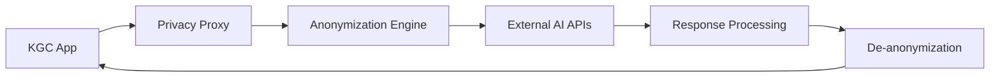

# KGC Privacy Proxy Service

## Overview
A dedicated microservice for handling Personally Identifiable Information (PII) and Protected Health Information (PHI) anonymization and de-anonymization. This service ensures Australian compliance with privacy laws and healthcare regulations.

## Purpose
This service acts as a privacy-first proxy between the KGC application and external AI providers (OpenAI, Anthropic), ensuring that sensitive patient data is anonymized before leaving Australian infrastructure.

## Technology Stack
- **Runtime**: Node.js 20 + TypeScript
- **Framework**: Express.js (lightweight, focused)
- **Encryption**: AES-256-GCM for data protection
- **Session Management**: Redis for anonymization mappings
- **Monitoring**: Audit logging for compliance
- **Deployment**: Docker containers on AWS/GCP

## Current Implementation Status
**Status**: Planned for Phase 8-9 (Privacy Infrastructure Enhancement)

Currently, privacy protection is implemented within the main API service:
- `server/services/privacyProtectionAgent.ts` - PII/PHI anonymization
- `server/services/privacyService.ts` - Data anonymization utilities

## Future Architecture

### Workflow


### Core Responsibilities
1. **PII Detection**: Identify sensitive data patterns
2. **Anonymization**: Replace PII/PHI with safe placeholders
3. **Session Management**: Track anonymization mappings
4. **External API Calls**: Communicate with AI providers
5. **De-anonymization**: Restore original context
6. **Audit Logging**: Track all privacy operations

## Australian Compliance Features

### Data Classification
- **PII**: Names, addresses, phone numbers, email addresses
- **PHI**: Health conditions, medications, symptoms, treatments
- **Identifiers**: UINs, Medicare numbers, healthcare provider IDs
- **Location Data**: Specific addresses, medical facilities

### Privacy Principles Alignment
- **APP 3**: Collection limitation - minimal data processing
- **APP 6**: Use limitation - anonymized data only
- **APP 8**: Cross-border disclosure - controlled and logged
- **APP 11**: Security - encryption and access controls
- **APP 12**: Individual access - audit trails available

### TGA Class I SaMD Compliance
- **Non-diagnostic scope**: Ensure AI responses stay within guidance boundaries
- **Medical professional oversight**: Log interactions requiring clinical review
- **Emergency detection**: Route urgent communications appropriately

## Service Interface

### Anonymization Endpoint
```typescript
POST /api/privacy/anonymize
{
  "text": "Patient John Smith reported chest pain today",
  "sessionId": "sess_abc123",
  "userId": 456,
  "context": "health_consultation"
}

Response:
{
  "anonymizedText": "[PATIENT_NAME_1] reported [SYMPTOM_1] today",
  "sessionId": "sess_abc123",
  "piiDetected": ["NAME", "SYMPTOM"],
  "success": true
}
```

### External AI Processing
```typescript
POST /api/privacy/process-ai
{
  "anonymizedText": "[PATIENT_NAME_1] reported [SYMPTOM_1] today",
  "provider": "openai",
  "model": "gpt-4o",
  "systemPrompt": "Healthcare guidance...",
  "sessionId": "sess_abc123"
}

Response:
{
  "originalResponse": "[PATIENT_NAME_1], please consult your doctor about [SYMPTOM_1]",
  "deanonymizedResponse": "John Smith, please consult your doctor about chest pain",
  "sessionId": "sess_abc123",
  "success": true
}
```

### Audit Logging
```typescript
GET /api/privacy/audit/{userId}
{
  "events": [
    {
      "timestamp": "2025-01-20T10:35:33.000Z",
      "userId": 456,
      "action": "ANONYMIZE",
      "piiTypes": ["NAME", "SYMPTOM"],
      "sessionId": "sess_abc123",
      "success": true
    }
  ]
}
```

## Migration Plan (P8-9)

### Phase 8: Service Extraction
1. Extract privacy logic from main API service
2. Create standalone Docker container
3. Implement service-to-service authentication
4. Set up dedicated Redis for session management

### Phase 9: Regional Deployment
1. Deploy in Australian regions (ap-southeast-2)
2. Implement data residency controls
3. Set up cross-border monitoring
4. Configure compliance logging

## Environment Variables
```bash
# Service Configuration
NODE_ENV=production
PORT=8081
SERVICE_NAME=kgc-privacy-proxy

# Data Residency
AWS_REGION=ap-southeast-2
DATA_RESIDENCY_REGION=AU
ALLOWED_CROSS_BORDER_PROVIDERS=openai.com,anthropic.com

# Encryption
ENCRYPTION_KEY=your_256_bit_encryption_key
ANONYMIZATION_SALT=your_anonymization_salt

# Session Storage
REDIS_URL=redis://privacy-sessions:6379
SESSION_TTL=3600

# External AI APIs
OPENAI_API_KEY=your_openai_key
ANTHROPIC_API_KEY=your_anthropic_key

# Monitoring
AUDIT_LOG_LEVEL=info
COMPLIANCE_REPORTING_ENABLED=true
```

## Security Features

### Data Protection
- **Encryption at Rest**: AES-256-GCM for stored mappings
- **Encryption in Transit**: TLS 1.3 for all communications
- **Memory Protection**: Secure memory clearing after processing
- **Access Logging**: All service interactions audited

### Network Security
- **VPC Isolation**: Private network for service communication
- **Firewall Rules**: Restricted ingress/egress
- **Service Mesh**: mTLS between KGC services
- **Rate Limiting**: Protection against abuse

### Compliance Monitoring
- **Data Residency**: Ensure data stays in Australia
- **Cross-border Tracking**: Log any data leaving AU
- **Retention Policies**: Auto-delete anonymization sessions
- **Breach Detection**: Alert on suspicious patterns

## Performance Requirements
- **Latency**: <200ms for anonymization operations
- **Throughput**: 1000+ requests/second
- **Availability**: 99.9% uptime SLA
- **Recovery**: <5 minute RTO for service restoration

## Monitoring & Observability
- **Health Checks**: Service and dependency status
- **Metrics**: Anonymization success rates, response times
- **Alerts**: Failed operations, compliance violations
- **Dashboards**: Real-time privacy operation monitoring

## Development Commands
```bash
# Run service locally
pnpm dev

# Type checking
pnpm type-check

# Build container
pnpm docker:build

# Run tests
pnpm test

# Compliance checks
pnpm audit:privacy

# Performance testing
pnpm test:load
```

## Testing Strategy
- **Unit Tests**: Anonymization algorithms
- **Integration Tests**: API endpoints
- **Compliance Tests**: Privacy regulation adherence
- **Performance Tests**: Load and stress testing
- **Security Tests**: Penetration testing